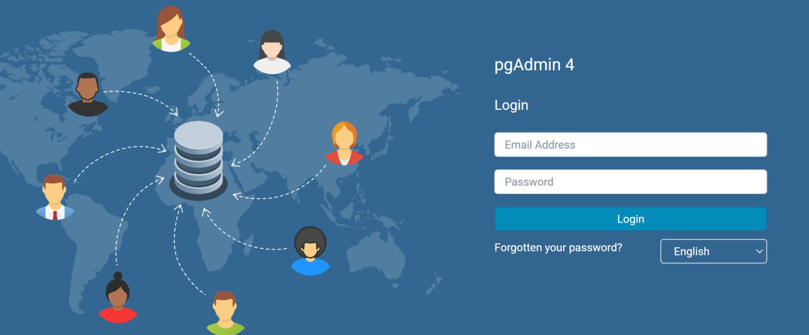

# DOMinators 
**Простая игра, вдохновленная Agar.IO**  
DOMinators  — это аркада, в которой игрок управляет клеткой. Цель игры — поглощать мелкие клетки, чтобы становиться больше, и избегать более крупных игроков, чтобы выжить.

Игрок управляет клеткой, поглощая более мелкие объекты и избегая более крупных врагов, чтобы выжить и расти.

Этот проект — клон оригинальной Agar.IO, созданный для обучения и расширения навыков веб-разработки.


### Демо игры - http://195.58.38.125:3434/

### Видео-презентация задач 5 и 6 спринтов
https://disk.yandex.ru/i/Ab5oxhYAhM4bZw

### Видео-презентация задач 5 и 6 спринтов
https://disk.yandex.ru/i/iz3ms5x3Fq_OzQ

----------
## 🚀 **Особенности**

-   Веб-интерфейс на **React (HTML5 и TypeScript)**.
-   Масштабирование карты при увеличении размера клетки.
-   Интуитивно понятный интерфейс и система роста.
-   Поддержка комьюнити игры на форуме
-   Кастомизация игрового шарика

# Страницы приложения: 

## **Главная страница**

### 📄 **URL**: `/main`
-   Отображает название игры и приветственное сообщение.
-   Кнопка **"Play"**, которая начинает игру.
-   Меню для перехода по страницам приложения
-   
## **Игровая страница**

### 📄 **URL**: `/game`

Основная страница игры, где происходит сам процесс:
-   Игровое поле с клетками игроков и едой.
-   Панель статистики: текущий размер клетки.

**Основные элементы**:
-   Игровое поле (Canvas).

**Управление**:

-   Мышь — перемещение.
-   Клавиша `Space` — ускорение клетки.


## **Страница лидерборда**

### 📄 **URL**: `/leaderboard`
Отображает текущих лидеров игры.


## **Страница форума**

### 📄 **URL**: `/forum`

Позволяет игрокам общаться на определенные темы, есть возможность создать собственную тему, ставить реакции emoji


## **Страница профиля**

### 📄 **URL**: `/profile`
На странице можно: 
-   Изменить информацию "о себе".
-   Поменять пароль.
-   Кастомизировать свой шарик для игры


## Страница логина
## Страница регистрации
## Страница ошибок

----------

### Как запускать?

1. Убедитесь что у вас установлен `node` и `docker`
2. Выполните команду `yarn bootstrap` - это обязательный шаг, без него ничего работать не будет :)
3. Выполните команду `yarn dev`
3. Выполните команду `yarn dev --scope=client` чтобы запустить только клиент
4. Выполните команду `yarn dev --scope=server` чтобы запустить только server


### Как добавить зависимости?
В этом проекте используется `monorepo` на основе [`lerna`](https://github.com/lerna/lerna)

Чтобы добавить зависимость для клиента 
```yarn lerna add {your_dep} --scope client```

Для сервера
```yarn lerna add {your_dep} --scope server```

И для клиента и для сервера
```yarn lerna add {your_dep}```


Если вы хотите добавить dev зависимость, проделайте то же самое, но с флагом `dev`
```yarn lerna add {your_dep} --dev --scope server```


### Тесты

Для клиента используется [`react-testing-library`](https://testing-library.com/docs/react-testing-library/intro/)

```yarn test```

### Линтинг

```yarn lint```

### Форматирование prettier

```yarn format```

### Production build

```yarn build```

И чтобы посмотреть что получилось


`yarn preview --scope client`
`yarn preview --scope server`

## Хуки
В проекте используется [lefthook](https://github.com/evilmartians/lefthook)

## Production окружение в докере
Перед первым запуском выполните `node init.js`


`docker compose up` - запустит три сервиса
1. nginx, раздающий клиентскую статику (client)
2. node, ваш сервер (server)
3. postgres, вашу базу данных (postgres)

Если вам понадобится только один сервис, просто уточните какой в команде
`docker compose up {sevice_name}`, например `docker compose up server`

## Development окружение в докере

- `docker-compose -f docker-compose.dev.yml build` - собирает все необходимое окружение
- `docker-compose -f docker-compose.dev.yml up` - запускает все необходимое окружение

## Первый запуск

- Клиен: http://localhost:${CLIENT_PORT}
- Сервер: http://localhost:${SERVER_PORT}
- Postgres: http://localhost:${POSTGRES_PORT}

После того как окружение в докере будет запущено, для инициализации бд необходимо зайти на http://localhost:${POSTGRES_PORT}.

В полях авторизиации необходимо ввести:
- login: PGADMIN_DEFAULT_EMAIL
- password: PGADMIN_DEFAULT_PASSWORD

Далее необходимо поднять новый сервер: 

- Host name/address: POSTGRES_HOST
- Port: POSTGRES_PORT
- Maintenance database: POSTGRES_DB
- Username: POSTGRES_USER
- Password: POSTGRES_PASSWORD
