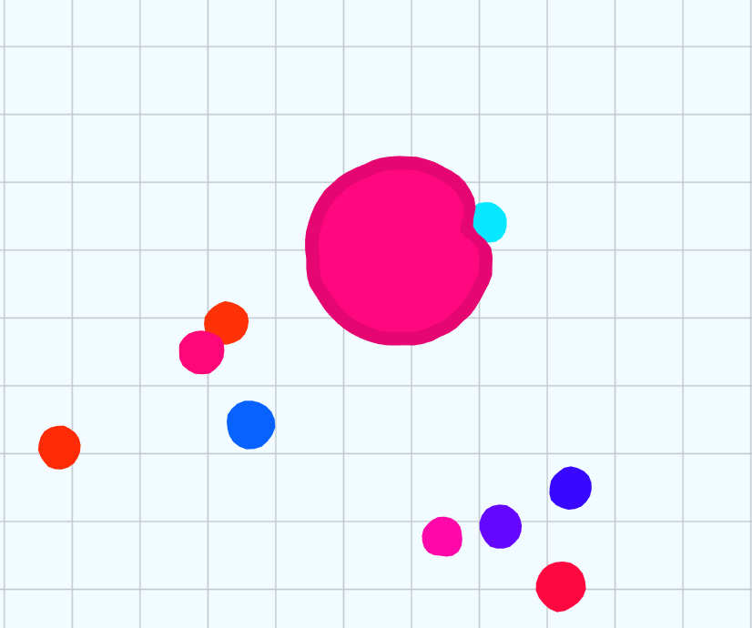

# Документация игры DOMinators

## Цель игры
Стать самым большим существом на арене.

## Механика игры

Механика игры заключается в управлении круглой клеткой, которая растет за счёт поглощения бактерий и других (меньших) игроков. Чем больше ваша пища, тем больше станет масса вашей клетки. Чем выше размер клетки, тем меньше скорость перемещения. В игре присутствуют колючие клетки-вирусы, которые могут разделять большие клетки.

Ключевые механики:

* Поглощение меньших клеток.
* Разделение клетки на части.
* Ускорение клетки (с потерей массы).
* Взаимодействие с вирусами (зеленые объекты).

## Таблица лидеров

По результатам каждой игры сохраняется итоговый размер вашей клетки. Чем больше оказалась ваша клетка, тем выше вы в таблице лидеров.

## Платформа

Браузер

## Управление

Перемещение мышью (или пальцем на мобильных устройствах).

## Используемые технологии

React, ReduxToolkit, Node.js, Canvas
